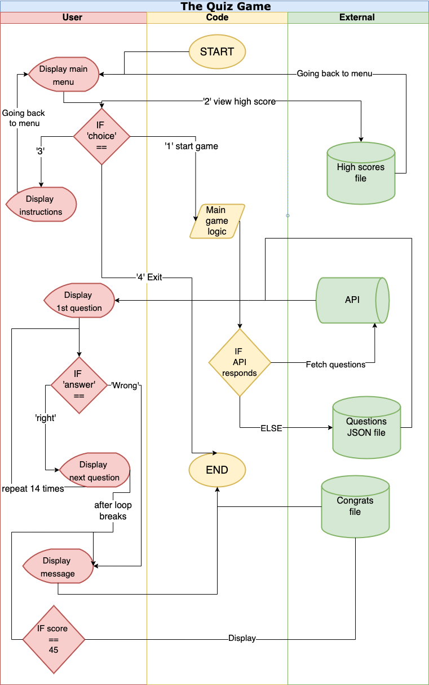
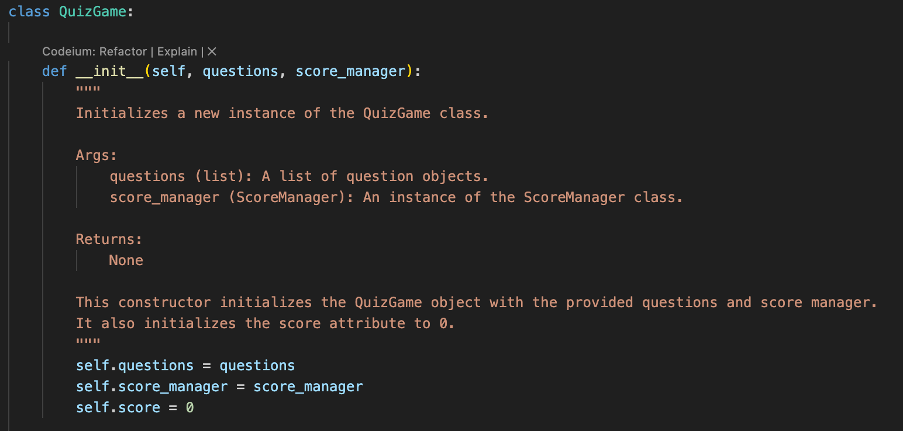
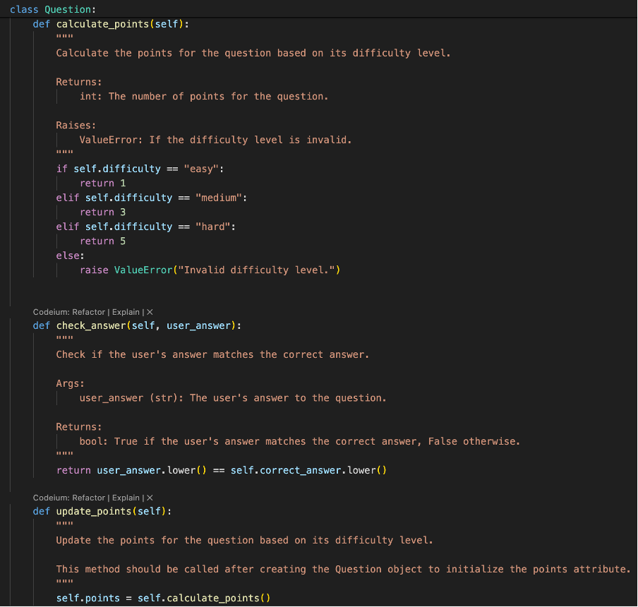
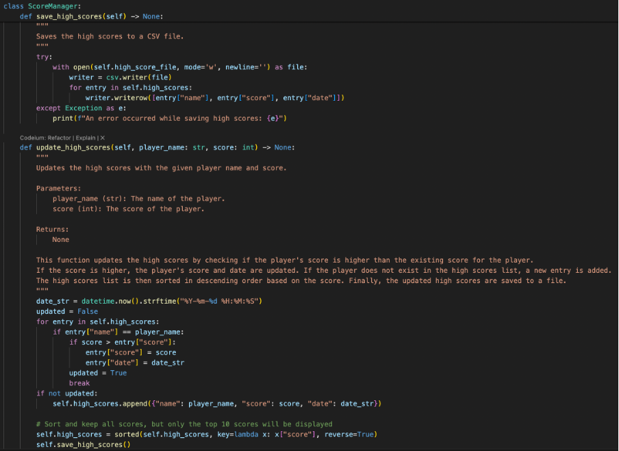
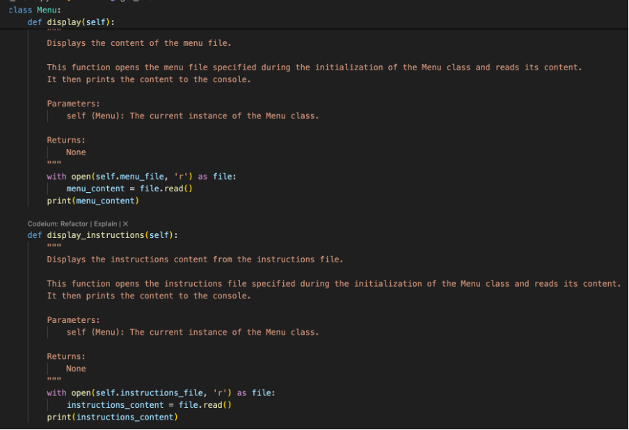
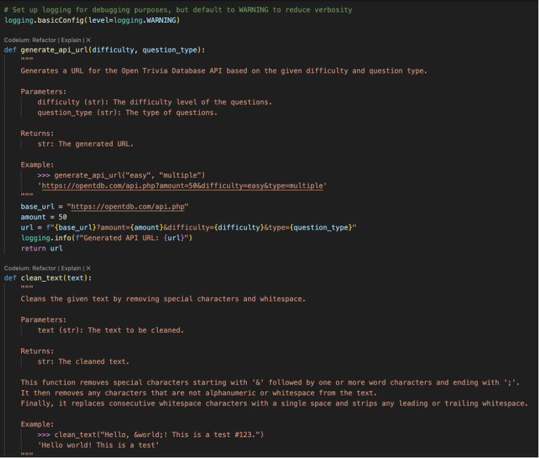
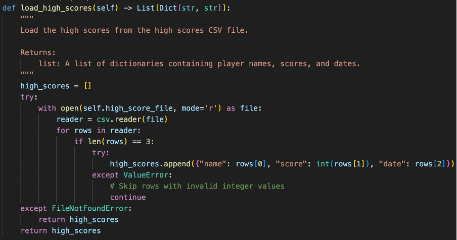

# Quiz Game Project

## Table of Contents
1. [Introduction](#introduction)
2. [Project Summary](#project-summary)
3. [Environment Setup](#environment-setup)
4. [Implementation Details](#implementation-details)
   - [Quiz Game Structure](#quiz-game-structure)
   - [Class-Based Approach and Methods](#class-based-approach-and-methods)
   - [Scoring System Implementation](#scoring-system-implementation)
   - [High Score System Implementation](#high-score-system-implementation)
   - [Menu System Implementation](#menu-system-implementation)
   - [API Integration](#api-integration)
   - [Error Handling](#error-handling)
5. [Conclusion](#conclusion)
6. [Tools used](#tools-used)
7. [Appendix](#Appendix)

## Introduction

### Overview of the Project:

Hello and welcome to The Quiz Game Project! This is an interactive Python application designed to provide players with an engaging quiz experience, although there is no GUI implementation, the game has several elements that helps make up for it. The project aims to combine elements of entertainment and education by offering a variety of general knowledge questions and difficulty levels. Users can test their knowledge and compete for high scores!

### Purpose:

The primary purpose of the Quiz Game Project is to create a fun and interactive learning experience for users of all ages, as long as they can use a computer. By offering a diverse range of questions and topics, the project aims to target to a wide audience and encourage continuous learning and exploration.

The objectives:

1. Providing an entertaining platform for users to engage in quiz activities.
2. Offering a variety of questions across different categories and difficulty levels.
3. Implementing a scoring system to track users' performance and progress.
4. Incorporating a high score system to promote competition and achievement.
5. Creating a user-friendly interface with intuitive navigation and interaction.

Through these objectives, the Quiz Game Project seeks to promote learning, stimulate curiosity, and foster a sense of achievement and competition among its users.


## Project Summary

Key features of the Quiz Game Project include:

- **Diverse Question Database:** The project offers a vast database of questions covering a wide range of topics, including general knowledge, science, history, geography, and more.

- **Multiple Difficulty Levels:** Questions in the Quiz Game Project are categorized into easy, medium, and hard difficulty levels. This ensures that users of varying skill levels can find suitable challenges and progress at their own pace.

- **Scoring System:** The project includes a scoring system that tracks users' performance throughout the quiz. Users earn points for each correct answer and can track their progress as they advance through the quiz.

- **High Score Leaderboard:** To promote competition and achievement, the Quiz Game Project features a high score leaderboard. Users can compete for the top spots by achieving high scores and showcasing their knowledge and skills.

- **Interactive User Interface:** With a user-friendly interface and interactive design, the Quiz Game Project provides a seamless and enjoyable experience for users. Clear instructions, vibrant visuals, and intuitive controls enhance user engagement and satisfaction.

## Environment Setup

### Installing Dependencies and Setting Up the Environment

#### Getting Started with the Code

If you want to try this code out you can follow these instructions:


1. First things first! Let's get the code onto your computer. Open up your terminal and clone the repository:
   ```sh
   git clone <https://github.com/Nedozzz-Rexx/quiz-game.git>
   ```
 
#### Setting Up Your Workspace
1. Great job on getting the code! Now, let's set up a cozy little workspace for it. Navigate to the directory where you cloned the repository in your terminal.
2. Time to create a special space just for this project. Type in the following command:
   ```sh
   python3 -m venv venv
   ```
3. Now, let's step into this new space. Activate your virtual environment:
   - For Mac/Linux users, type:
     ```sh
     source venv/bin/activate
     ```
   - For Windows users, type:
     ```sh
     .\venv\Scripts\activate
     ```

#### Installing the Magic Ingredients
1. We're almost there! Now, let's sprinkle in some magic. We need to install all the special tools and libraries this project depends on. Luckily, it's as easy as pie:
   ```sh
   pip install -r requirements.txt
   ```

Fantastic job! Your environment is all set up and ready to go. Time to dive into the project and let your creativity shine! Feel free to contact me if you run into any trouble!

## Implementation Details

### Quiz Game Structure
<details>
  <summary>Flowchart</summary>
  
</details>
<p>This flowchart illustrates the overall structure of the Quiz Game, outlining the interaction between the user, the code, and external components. The game starts with displaying the main menu, where the user can choose to start the game, view high scores, or read instructions. If the user chooses to start the game, the game logic proceeds by fetching questions either from an API or a local JSON file. The user answers a series of questions, and their score is updated accordingly. The game ends if the user answers incorrectly or completes all questions. The final score is displayed, and if it meets certain criteria, a congratulatory message is shown. High scores are managed and retrieved from a separate file..</p>

### Class-Based Approach and Methods
<details>
  <summary>Screenshot example</summary>
  
</details>
<p>In this project, a class-based approach is utilized to create a structured and modular quiz game. This approach allows for better organization of code, making it more manageable, reusable, and easier to debug. By defining classes, we encapsulate related data and behaviors, providing a clear blueprint for the components of the quiz game.

For example, the QuizGame class is the central component responsible for managing the quiz logic, interacting with the user, and keeping track of the score. Above is the constructor of the QuizGame class, which demonstrates the initialization process and the role of this class in the game:</p>

### Scoring System Implementation
<details>
  <summary>Screenshot example</summary>
  
</details>
<p>The scoring system implementation is depicted in this image. It explains how points are assigned for correct answers and how the final score is calculated.</p>
The scoring system in the quiz game is designed to reward players based on the difficulty level of the questions they answer correctly. The implementation involves calculating points for each question, checking the user's answer, and updating the points accordingly.

### High Score System Implementation
<details>
  <summary>Screenshot example</summary>
  
</details>
<p>This section illustrates the high score system. It shows how scores are saved, sorted, and displayed to the user, including how new high scores are recorded.</p>
The high score system in the quiz game is designed to keep track of the top scores achieved by players, ensuring that high scores are saved, updated, and displayed in a user-friendly manner.

### Menu System Implementation
<details>
  <summary>Screenshot example</summary>
  
</details>
<p>The menu system in the quiz game serves as the primary interface for users to interact with the game. It allows players to start the game, view the leaderboardn & instructions, and exit the game.</p>
The display method is responsible for displaying the main menu content to the user. This method reads the content of the menu file and prints it to the console.

### API Integration
<details>
  <summary>Screenshot example</summary>
  
</details>
<p>This image demonstrates the API integration used in the game. It covers how external data is fetched and utilized within the quiz.</p>
The API integration in this quiz game is a crucial feature that allows the game to fetch diverse questions from an external source, specifically the Open Trivia Database API. This ensures that players have a varied and up-to-date set of questions each time they play.

### Error Handling
<details>
  <summary>Screenshot example</summary>
  
</details>
<p>The image shows an example of how different types of errors are managed to ensure a smooth user experience.</p>
Effective error handling is a critical aspect of this quiz game, ensuring that the game runs smoothly and can recover gracefully from unexpected issues. Here is an example of how error handling is implemented, specifically in the context of loading high scores from a CSV file.

## Conclusion

### Reflection on the Challenges Faced and Lessons Learned:

- **Challenges Faced:**
  - Error handling for invalid user input, especially for non-numeric answers. E.g if the user wants to enter the answer instead of the number of the answer. (1.True)
  - Correctly calculating the score after each question.
  - Pushing changes to GitHub when remote contains work not present locally.

- **Lessons Learned:**
  - Implemented error handling for user input using conditional statements and try-except blocks.
  - Debugged scoring logic by adding print statements to track score calculation.
  - Learned to use 'git pull' to integrate remote changes before pushing to avoid conflicts, and merging the branches.

### Future Improvements
- **Potential Enhancements:**
  - Add a settings menu, where the user can choose if they want to reveal the correct answer after they got it wrong, and adding the flexibility of adjusting how the gameplay is.
  - Add more logging for better debugging and tracking of program execution, and improve on testing implementations.

## Tools used

- [Open Trivia Database API](https://opentdb.com/api_config.php): Used to fetch trivia questions for the quiz.
- [Draw.io](https://app.diagrams.net/): Utilized for creating diagrams and flowcharts to illustrate the quiz game structure.
- [Visual Studio Code](https://code.visualstudio.com/): The code editor used for writing and managing the project's codebase.
- [Codeium](https://codeium.com/): Free AI-powered code acceleration toolkit built on cutting edge AI technology, providing autocomplete, chat, and search capabilities in 70+ languages.
- [ChatGPT by OpenAI](https://www.openai.com/chatgpt): Used for providing code suggestions and assistance during the development process.
- [ASCII Art Generator (Patorjk.com)](http://patorjk.com/software/taag/#p=display&f=Graffiti&t=Type%20Something%20): Used to generate ASCII art for enhancing the game's visual elements.


## Appendix

### YouTube Demo: Trivia Game Implementation with Python and VS Code

[](https://youtu.be/NaluRsbmvEw)

Watch the demo video showcasing the implementation of a trivia game using Python and VS Code. Explore the integration of API techniques and version control strategies to create a seamless gaming experience. Join us on this journey into the world of technology and psychology!


